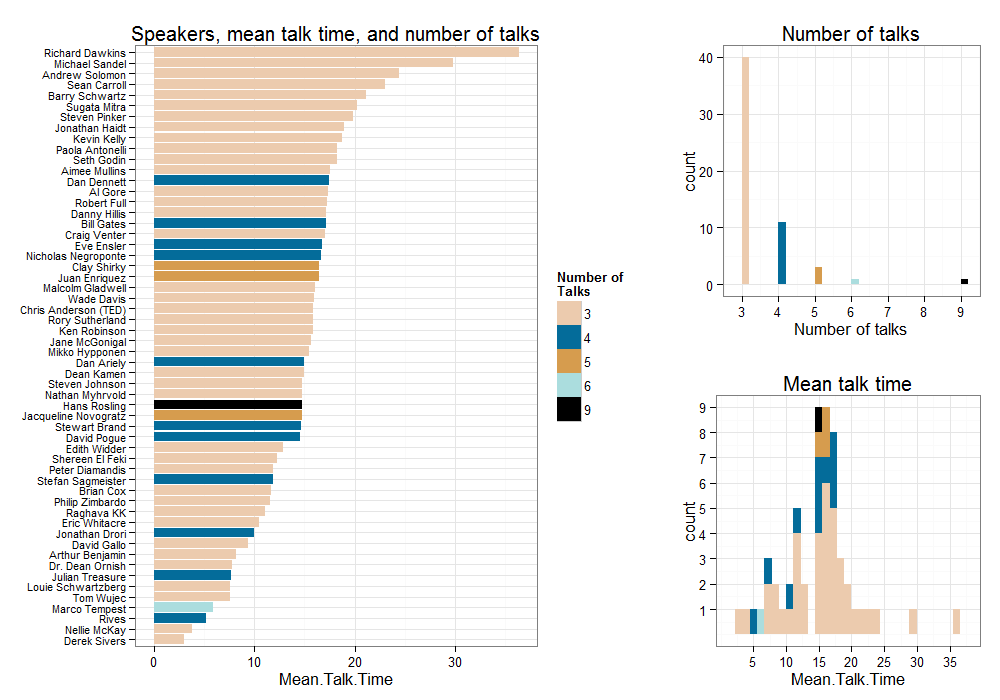

Word Cloud of Ted Talk Titles and Identifying Frequent Speakers 
==============================================================

A recent [article in openculture.com by Dan Colman](http://www.openculture.com/2014/06/1756-ted-talks-listed-in-a-neat-spreadsheet.html) mentioned that there was a [list of 1756 Ted Talks] maintained by "someone" in a spreadsheet format. A link to this sheet can also be found on [this page on Wikipedia](http://en.wikipedia.org/wiki/List_of_TED_speakers). It was titled "Ted Talks as of 5/23/2014". I downloaded that spreadsheet on 6/12/2014 from [this link](https://spreadsheets.google.com/ccc?hl=en&key=pjGlYH-8AK8ffDa6o2bYlXg&hl=en#gid=0) and saved that as a csv file. It turned out to be a list of 1755 talks. Here, I make a wordcloud of the titles of these talks and a few ggplots to identify speakers with 3 or more appearances using Karthik Ram's Wes Anderson palette for R.  

# Reading the data in


```r
library(stringr)
library(tm)
library(wordcloud)
library(wesanderson)
library(ggplot2)
library(dplyr)
library(gridExtra)
library(knitr)
ted <- read.csv("ted.csv")
colnames(ted)
```

[1] "URL"           "ID"            "URL.1"         "Speaker"      
[5] "Name"          "Short.Summary" "Event"         "Duration"     
[9] "Publish.date" 
  
Columns of interest in this study are the names of the "Speaker", titles of the talk - "Name" column, and Duration of the talk ("Duration" column). Latter titles seem to have the first and last names of the speakers. Upon going through that column, I realized that this practice began with the 424th entry. To be safe, let's remove the first two words from that point on. 

# Some Cleaning

In this piece, we remove the first two words from the 424th entry onward. We then clean up the text by removing some punctuations, extra spaces, and any URLs that may be present.  


```r
ted$Name <- as.character(ted$Name)
for (i in 424:nrow(ted)) {
    ted$Name[i] <- word(ted$Name[i], 3, -1)
}  # Removing first two words from row 424 onwards

# Function to clean text ## from Gaston Sanchez's work
# (https://sites.google.com/site/miningtwitter/questions/talking-about/wordclouds/comparison-cloud)
clean.text <- function(x) {
    # to lowercase
    x <- tolower(x)
    # remove punctuation marks
    x <- gsub("[[:punct:]]", "", x)
    # remove numbers
    x <- gsub("[[:digit:]]", "", x)
    # remove tabs and extra spaces
    x <- gsub("[ |\t]{2,}", "", x)
    # remove blank spaces at the beginning
    x <- gsub("^ ", "", x)
    # remove blank spaces at the end
    x <- gsub(" $", "", x)
    # result
    return(x)
}
```

# Word cloud of popular words in Titles


```r
myCorpus <- Corpus(VectorSource(clean.text(ted$Name)))
myStopwords <- c(stopwords("english"), "ted prize wish")
# The latter was required because there were few titles with that
# phrase

myCorpus <- tm_map(myCorpus, removeWords, myStopwords)
tdmpremat <- TermDocumentMatrix(myCorpus)
tdm <- as.matrix(tdmpremat)
sortedMatrix <- sort(rowSums(tdm), decreasing = TRUE)
tdmframe <- data.frame(word = names(sortedMatrix), freq = sortedMatrix)

# plotting words that appear at least 5 times
wordcloud(tdmframe$word, tdmframe$freq, random.order = FALSE, random.color = FALSE, 
    min.freq = 5, scale = c(5, 0.2), colors = wes.palette(5, "Darjeeling"))
```

 

# Speakers with more than 2 appearances and mean duration of their talks


```r
numtalks <- data.frame(table(ted$Speaker))
table(numtalks$Freq)
```

```
## 
##    1    2    3    4    5    6    9 
## 1301  130   40   11    3    1    1
```

There were 1487 different speakers. 1301 of them gave one talk, whereas 130 of them had given two talks. Below, I will focus on only those people who have given more than 2 talks, which is a list of 56 people. 

Let's first deal with the duration of talk variable. Here, we compute the mean duration of talks for this group of 56.


```r
# Function adapted from
# http://stackoverflow.com/questions/5186972/how-to-convert-time-mmss-to-decimal-form-in-r
ted$TalkTime <- sapply(strsplit(as.character(ted$Duration), ":"), function(x) {
    x <- as.numeric(x)
    x[1] * 60 + x[2] + x[3]/60
})

speakfreqandduration <- ted %>% group_by(Speaker) %>% summarise(NumTalks = n(), 
    Mean.Talk.Time = mean(TalkTime, na.rm = TRUE)) %>% filter(NumTalks > 
    2)

kable(summary(speakfreqandduration$Mean.Talk.Time), row.names = FALSE)
```

```
## Error: 'dimnames' applied to non-array
```
The mean and median talk times are around 15 minutes. There are, of course, talks that are longer and shorter than those. More on those in the charts below.


```r
gg1 <- ggplot(speakfreqandduration, aes(x = NumTalks, fill = as.factor(NumTalks))) + 
    scale_x_continuous(breaks = 1:10) + geom_histogram() + xlab("Number of talks") + 
    ggtitle("Number of talks") + scale_fill_manual(values = wes.palette(5, 
    "Darjeeling2")) + theme_bw() + theme(legend.position = "none")

gg2 <- ggplot(speakfreqandduration, aes(x = Mean.Talk.Time, fill = as.factor(NumTalks))) + 
    scale_x_continuous(breaks = c(5, 10, 15, 20, 25, 30, 35, 40, 45, 50, 
        55, 60, 65, 70)) + geom_histogram() + scale_fill_manual(values = wes.palette(5, 
    "Darjeeling2")) + ggtitle("Mean talk time") + theme_bw() + theme(legend.position = "none") + 
    scale_y_continuous(breaks = 1:10)

gg3 <- ggplot(speakfreqandduration, aes(x = reorder(Speaker, Mean.Talk.Time), 
    y = Mean.Talk.Time, fill = as.factor(NumTalks))) + scale_fill_manual(values = wes.palette(5, 
    "Darjeeling2"), name = ("Number of\nTalks")) + geom_bar(stat = "identity") + 
    xlab("Speaker") + theme_bw() + coord_flip() + ggtitle("Speakers, mean talk time, and number of talks")

grid.arrange(gg3, arrangeGrob(gg1, gg2, ncol = 1), ncol = 2, widths = c(2, 
    1))
```

```
## stat_bin: binwidth defaulted to range/30. Use 'binwidth = x' to adjust this.
## stat_bin: binwidth defaulted to range/30. Use 'binwidth = x' to adjust this.
```

 

Assuming that many talks were scheduled for 15 mins, did you see that none of these speakers had a mean talk time of around 14 mins? They all stretched their talk to either take up the whole time or perhaps, extended their talk a bit. 
